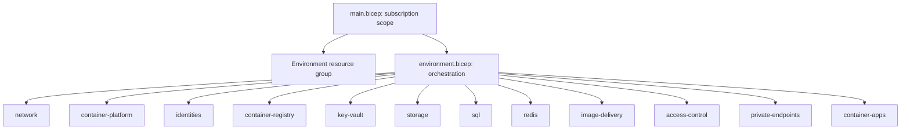

# Shopping End-to-End Deployment Runbook

This is the canonical guide for creating a new Shopping installation, deploying it to Azure, and operating its delivery pipeline. It starts with an empty Azure subscription and a cloned repository and ends with verified development, test, and production environments.

Use the focused references for deeper details:

- [Environment bootstrap](bootstrap.md)
- [External ID portal reference](entra-external-id-setup.md)
- [Recurring CI/CD operations](deployment-playbook.md)
- [Infrastructure reference](../infra/README.md)

## 1. Understand The Deployment

Shopping is a Blazor Web App using the backend-for-frontend pattern:

```text
Browser
  -> public HTTPS Shopping.Web (cookie session)
  -> internal HTTPS Shopping.Api (delegated access token)
  -> Azure SQL and private Blob Storage
```

`Shopping.Web` signs customers in through Microsoft Entra External ID, stores its authentication session in a secure HTTP-only browser cookie, and acquires API tokens server-side. Distributed token state uses Azure Managed Redis. The browser never receives the API access token and does not call `Shopping.Api` directly.

Each `dev`, `test`, or `prod` environment is a separate resource group. The resource names are deterministic from:

```text
WORKLOAD_NAME + DEPLOYMENT_INSTANCE + environment + RESOURCE_SUFFIX
```

Do not change `DEPLOYMENT_INSTANCE` or `RESOURCE_SUFFIX` after deployment. Doing so changes resource identities instead of updating the existing installation.

### Ownership Boundaries

| Owner | Responsibilities |
| --- | --- |
| Operator | Create subscriptions and the External ID tenant, provide permissions, configure customer user flows, select identity providers, approve production, and protect credentials. |
| Bootstrap scripts | GitHub OIDC identity, Azure RBAC, External ID app registrations, API scope, app roles, consent, redirect URIs, GitHub environments, secrets, reviewer protection, and branch ruleset. |
| Bicep | Resource groups, networking, managed identities, ACR, Key Vault, Storage, SQL, Redis, Container Apps, observability, optional private endpoints, and Front Door. |
| `infra.yml` | Compile, validate, run `what-if`, deploy, and destroy Azure infrastructure. |
| `app.yml` | Build immutable images, push to ACR, migrate SQL, grant runtime database permissions, deploy Container Apps, and verify health. |
| Application | Authentication cookies, downstream token acquisition, authorization policies, API behavior, catalog data, and image SAS generation. |

The scripts do **not** create an External ID tenant or customer user flow. Microsoft requires the external tenant to exist before its app registrations and flows can be configured.

## 2. Collect Accounts, Permissions, And Values

You need:

- A GitHub account that can administer the target repository.
- An Azure resource tenant with an active subscription.
- `Owner`, or equivalent `Contributor` plus role-assignment permission, on the subscription.
- Permission to create Entra applications and service principals in the Azure resource tenant.
- Permission to create an External ID external tenant.
- External-tenant permission to create applications, grant tenant-wide consent, create users, and assign app roles.
- A GitHub user who will approve production deployments. A sole developer may approve their own deployment if repository policy allows it.

Record these non-secret values:

| Value | Source |
| --- | --- |
| Canonical repository | GitHub, including exact owner/repository casing |
| Default branch | This repository uses `master` |
| Azure resource tenant ID | Azure subscription directory |
| Azure subscription ID | Azure subscription overview |
| External ID tenant ID | External tenant overview after switching directories |
| External ID primary domain | `<tenant>.onmicrosoft.com` |
| External ID authority | `https://<tenant>.ciamlogin.com/` |
| Production reviewer | GitHub username |
| Installation name | Optional stable `InstanceName`; otherwise derived from the repository |

Keep these secret:

- SQL provisioning password.
- Shopping.Web client secret.
- Redis keys and connection string.
- Azure access tokens, customer temporary passwords, cookies, and API tokens.

## 3. Install And Verify Tools

Install Git, Azure CLI, GitHub CLI, .NET 10 SDK, Docker, and PowerShell. PowerShell 7 is preferred; Windows PowerShell 5.1 can run the current bootstrap scripts.

From the repository root:

```powershell
git --version
$PSVersionTable.PSVersion
az version
az bicep version
gh --version
dotnet --version
docker version
```

Expected results:

- `.NET SDK` is `10.x`.
- Azure CLI can run Bicep `build` and `build-params`.
- `gh auth status` identifies the GitHub account that administers the target repository.
- Docker is required for local development and container-image verification, not for the initial Azure bootstrap.

If Windows blocks a script, either use a process-only policy:

```powershell
Set-ExecutionPolicy -Scope Process -ExecutionPolicy Bypass
```

or invoke it without changing machine policy:

```powershell
powershell -NoProfile -ExecutionPolicy Bypass -File .\scripts\Test-ShoppingBootstrap.ps1 `
  -ConfigPath .\scripts\bootstrap.config.psd1
```

## 4. Prepare The Azure Resource Tenant

An "empty Azure tenant" still needs an active Azure subscription. The subscription pays for both the application resources and the External ID tenant billing link.

Sign in to the resource tenant and select the subscription:

```powershell
az login --tenant <azure-resource-tenant-id>
az account set --subscription <azure-subscription-id>
az account show --output table
```

Verify `TenantId`, `SubscriptionId`, and subscription name before continuing. Running bootstrap against the wrong tenant creates the deployment application in the wrong directory and produces unusable OIDC credentials.

Check Container Apps quota in the intended region before deployment. In Azure Portal, open **Quotas**, select **Azure Container Apps**, select the subscription and `UK South`, and inspect available consumption cores. The current dev/test baseline needs one warm Web replica and one warm API replica.

## 5. Create The External ID External Tenant Manually

Use the [Microsoft Entra admin center](https://entra.microsoft.com), not the Azure portal tenant-creation blade:

1. Sign in with the operator account.
2. Go to **Entra ID -> Overview -> Manage tenants**.
3. Select **Create**.
4. Select **External**, then **Continue**.
5. Enter the tenant name and unique domain prefix.
6. Select the required geographic location. This cannot be changed later.
7. On **Add a subscription**, select the Azure subscription and billing resource group.
8. Review and create the tenant. Creation can take up to approximately 30 minutes.
9. Use the directory selector in the portal header to switch into the new external tenant.

Record the external tenant's ID, primary domain, and `ciamlogin.com` authority from its overview. Do not copy the home/resource tenant ID by mistake.

The Azure resource tenant and External ID tenant are normally different directories. This is supported by the bootstrap orchestrator.

Official reference: [Create an external tenant](https://learn.microsoft.com/en-us/entra/external-id/customers/quickstart-tenant-setup).

## 6. Prepare The GitHub Repository

The repository must contain `.github/workflows/ci.yml`, `infra.yml`, `app.yml`, and `codeql.yml` on `master` before enabling the managed branch ruleset.

To import the repository for another organization:

```powershell
git clone <source-repository-url> Shopping
Set-Location .\Shopping
git remote rename origin upstream
gh repo create <owner>/<repository> --private --source . --remote origin
git push -u origin master
```

Use `--public` only when public source is intended. Confirm the canonical casing GitHub returns:

```powershell
gh auth login
gh repo view <owner>/<repository> --json nameWithOwner,defaultBranchRef
```

Bootstrap uses GitHub's effective, case-sensitive OIDC subject. `Owner/Repository` and `owner/repository` must not be treated as interchangeable.

## 7. Create Local Bootstrap Configuration

Create the ignored configuration file:

```powershell
Copy-Item .\scripts\bootstrap.config.example.psd1 `
          .\scripts\bootstrap.config.psd1
```

Populate:

```powershell
@{
    Repository = "<github-owner>/<github-repository>"
    Branch = "master"
    WorkloadName = "shopping"
    InstanceName = ""
    Environments = @("dev", "test", "prod")

    Azure = @{
        TenantId = "<azure-resource-tenant-id>"
        SubscriptionId = "<azure-subscription-id>"
        DeploymentRoles = @(
            "Contributor"
            "Role Based Access Control Administrator"
        )
    }

    ExternalId = @{
        TenantId = "<external-id-tenant-id>"
        Domain = "<external-tenant>.onmicrosoft.com"
        Instance = "https://<external-tenant>.ciamlogin.com/"
        WebRedirectUris = @(
            "https://localhost:7262/signin-oidc"
            "http://localhost:5140/signin-oidc"
        )
        PublicWebBaseUrls = @{
            dev = ""
            test = ""
            prod = ""
        }
        BootstrapAdminEmail = ""
        # Compatibility only for an existing installation.
        BootstrapAdminUserObjectId = ""
    }

    GitHub = @{
        ProductionReviewers = @("<github-user>")
        RulesetName = "protected master"
    }

    SqlAdministratorLogin = "sqladminuser"
}
```

`scripts/bootstrap.config.psd1` and `scripts/bootstrap-state.local.json` are ignored. Neither may contain secrets. State stores the normalized bootstrap-admin email, generated application/object IDs, and credential expiry metadata only.

Leave deployed Web base URLs empty initially. Container Apps assigns the default Web FQDN when the application images are first deployed.

## 8. Preview Bootstrap

Create the SQL password only in memory:

```powershell
$sqlPassword = Read-Host "SQL provisioning password" -AsSecureString
```

Use a long, generated password. Bootstrap pipes it directly into each GitHub Environment secret; it does not write the value to state.

Preview the complete operation:

```powershell
.\scripts\Initialize-ShoppingBootstrap.ps1 `
  -ConfigPath .\scripts\bootstrap.config.psd1 `
  -Stage All `
  -SqlAdministratorPassword $sqlPassword `
  -RotateWebClientSecret `
  -GrantAdminConsent `
  -ConfigureLocalUserSecrets `
  -AllowInteractiveTenantSwitch `
  -PromptForExternalIdValues `
  -WhatIf
```

The preview validates repository casing, tenant metadata, existing dedicated resources, intended roles, redirects, and GitHub settings. `-WhatIf` must not create or update resources.

For diagnosis, preview stages separately:

```powershell
.\scripts\Initialize-ShoppingBootstrap.ps1 -ConfigPath .\scripts\bootstrap.config.psd1 -Stage AzureIdentity -WhatIf
.\scripts\Initialize-ShoppingBootstrap.ps1 -ConfigPath .\scripts\bootstrap.config.psd1 -Stage ExternalId -WhatIf
.\scripts\Initialize-ShoppingBootstrap.ps1 -ConfigPath .\scripts\bootstrap.config.psd1 -Stage GitHub -WhatIf
```

## 9. Apply Bootstrap

Run all stages in one process when the resource and external tenants differ. This keeps a newly rotated Web secret in memory while the orchestrator switches tenants and writes the secret to GitHub:

```powershell
.\scripts\Initialize-ShoppingBootstrap.ps1 `
  -ConfigPath .\scripts\bootstrap.config.psd1 `
  -Stage All `
  -SqlAdministratorPassword $sqlPassword `
  -RotateWebClientSecret `
  -GrantAdminConsent `
  -ConfigureLocalUserSecrets `
  -AllowInteractiveTenantSwitch `
  -PromptForExternalIdValues
```

What the stages do:

| Stage | Result |
| --- | --- |
| `AzureIdentity` | Registers required resource providers, creates/adopts the GitHub deployment app and service principal, adds exact dev/test/prod OIDC subjects, and assigns configured subscription roles. |
| `ExternalId` | Creates/adopts Web/API applications, service principals, `access_as_user`, Web API permission, admin consent, app roles, redirect URIs, and the local bootstrap Admin with both application-role assignments. |
| `GitHub` | Creates dev/test/prod environments, writes variables/secrets, adds production reviewer protection, restricts production to `master`, and optionally manages the named branch ruleset. |

Enable branch protection only after workflow files exist on `master`:

```powershell
.\scripts\Initialize-ShoppingBootstrap.ps1 `
  -ConfigPath .\scripts\bootstrap.config.psd1 `
  -Stage GitHub `
  -ConfigureRuleset
```

Do not rotate the Web secret in a standalone `ExternalId` run unless the new value will also be sent to GitHub in that process. Entra displays a client-secret value only once.

## 10. Create The Customer User Flow

Switch the Entra admin center into the external tenant:

1. Go to **Entra ID -> External Identities -> User flows**.
2. Select **New user flow** or **Create**.
3. Choose the combined sign-up/sign-in flow offered by the current portal.
4. Enter a stable name such as `ShoppingSignUpSignIn`.
5. Select **Email Accounts** and choose email/password or email one-time passcode.
6. Collect only attributes the application genuinely needs, such as given name, surname, display name, and email address.
7. Create the flow.
8. Open the flow, select **Applications**, then add the bootstrap-managed Shopping.Web application.
9. Run the flow and confirm **No account? Create one** is available.

If Google, Facebook, Apple, or another provider is needed, configure it under **External Identities -> All identity providers**, then enable it in the user flow. The built-in Microsoft provider shown in workforce/B2B configuration is not automatically a customer-flow provider for personal Outlook accounts.

## 11. Create The Bootstrap Customer Administrator

The account used to administer the external tenant is not automatically a Shopping customer. A B2B administrative object and a customer object using the same email address are distinct identities. The bootstrap operation below creates an application customer; it does not grant a Microsoft Entra directory role.

Sign in to the external tenant as at least a User Administrator and run from a trusted local terminal:

```powershell
.\scripts\Initialize-ShoppingBootstrap.ps1 `
  -ConfigPath .\scripts\bootstrap.config.psd1 `
  -Stage ExternalId `
  -PromptForExternalIdValues
```

At `Bootstrap application administrator email`, enter the intended local customer sign-in address.

If no exact local `emailAddress` identity exists, bootstrap generates a cryptographically random 24-character password, creates the enabled local account with `forceChangePasswordNextSignIn`, and prints the email/password once in that terminal. Record it immediately. The value cannot be recovered from bootstrap state or a later run.

If the account already exists, bootstrap adopts it without resetting or displaying its password. It then assigns `Admin` on both the Web and API enterprise applications. Rerunning the same command is idempotent.

Do not run account creation in GitHub Actions or under PowerShell transcription. Do not store the temporary password in the repository, bootstrap configuration/state, user secrets, GitHub, Key Vault, tickets, command history, or workflow logs. Store `BootstrapAdminEmail` only when a non-interactive rerun must adopt an existing account. `BootstrapAdminUserObjectId` is a compatibility override for installations created by older bootstrap versions.

The administrator signs in once with the temporary password and completes Entra's required password change. Then run:

```powershell
.\scripts\Test-ShoppingBootstrap.ps1 `
  -ConfigPath .\scripts\bootstrap.config.psd1
```

The verifier confirms enabled status, the exact local identity, and both application `Admin` assignments. It cannot and does not inspect the password.

### Current Self-Sign-Up Limitation

The current Web and API `CustomerAccess` policies require the `Customer` or `Admin` app role. Entra self-service sign-up creates a customer account but does not automatically assign the `Customer` app role. Therefore a newly registered customer cannot use role-protected cart endpoints until an administrator or future provisioning workflow assigns that role. Do not describe sign-up as fully provisioned until this application behavior is changed.

## 12. Verify Bootstrap

Run the read-only verifier:

```powershell
.\scripts\Test-ShoppingBootstrap.ps1 `
  -ConfigPath .\scripts\bootstrap.config.psd1
```

Automated areas must report `Pass`:

- state and canonical repository;
- Azure OIDC credentials and RBAC;
- External ID apps, roles, scope, permission, and consent;
- enabled bootstrap Admin local identity and both application-role assignments;
- GitHub dev/test/prod values and protection;
- managed `master` ruleset.

`User flow` is intentionally `Manual`; confirm the flow includes Shopping.Web and intended providers in the portal.

## 13. Understand The Modular Bicep Deployment

`infra/main.bicep` runs at subscription scope, creates the environment resource group, and invokes `modules/environment.bicep`. The environment template is an orchestrator with no direct resources.



Important ordering:

- Container platform consumes the network subnet output.
- Redis waits for Key Vault before writing its connection-string secret.
- Access control waits for ACR, Storage, Key Vault, and identities.
- Container Apps wait for access-control assignments.
- Private endpoints consume resource and subnet outputs.
- `container-apps.bicep` is skipped while `containerImageTag` is `bootstrap`.

Validate locally:

```powershell
powershell -NoProfile -ExecutionPolicy Bypass -File .\infra\tests\Test-BicepModules.ps1
az bicep build --file .\infra\main.bicep
az bicep build-params --file .\infra\parameters\dev.bicepparam
az bicep build-params --file .\infra\parameters\test.bicepparam
az bicep build-params --file .\infra\parameters\prod.bicepparam
```

The current CLI may emit `BCP081` for Front Door resource API types when local type metadata is unavailable. It is non-blocking if there are no `ERROR` diagnostics; Azure deployment validation remains authoritative.

## 14. Pull Request And Merge Lifecycle

Create a feature branch:

```powershell
git switch master
git pull --ff-only
git switch -c feature/<short-description>
```

Make and verify changes, then push and create a pull request:

```powershell
git push -u origin feature/<short-description>
gh pr create --base master --fill
```

Required checks include:

- `ci-build`;
- `ci-test`;
- `container-build`;
- `CodeQL`;
- `infra-static-validation-dev`;
- `infra-static-validation-test`;
- `infra-static-validation-prod`.

Pull requests compile all environment parameter files but do not deploy Azure resources. Resolve review threads and merge only after checks pass.

When merged to `master`:

1. `ci.yml` and CodeQL validate the merge commit.
2. `infra.yml` compares the changed paths.
3. If `infra/` or `infra.yml` changed, `infra-deploy-dev` validates, runs `what-if`, and reconciles dev.
4. A successful push-triggered `infra` workflow starts `app.yml` for dev.
5. `app.yml` builds Web/API images tagged with the merge commit SHA, pushes them to ACR, migrates SQL, grants runtime database permissions, deploys Container Apps, and checks health.

Current behavior: a code-only merge can still trigger the dev application workflow after the successful `infra` workflow even when `infra-deploy-dev` is skipped by path filtering. This is harmless but can produce an unnecessary rebuild/redeployment.

## 15. First Development Deployment

The normal path is to merge the reviewed IaC to `master`. To start manually from GitHub:

```powershell
gh workflow run infra.yml --ref master `
  -f operation=deploy `
  -f environmentName=dev `
  -f location=uksouth
```

Watch the run:

```powershell
gh run list --workflow infra.yml --limit 5
gh run watch <run-id> --exit-status
```

The first infrastructure deployment creates ACR, networking, identities, Key Vault, Storage, SQL, Redis, and observability. It does not create Container Apps while the image tag is `bootstrap`.

Then deploy application images:

```powershell
gh workflow run app.yml --ref master `
  -f environmentName=dev `
  -f migrateDatabase=true
```

The app workflow:

1. Authenticates to Azure through GitHub OIDC.
2. Resolves the deterministic resource group and ACR.
3. Builds and pushes immutable commit-SHA images.
4. Opens a temporary SQL firewall rule for the hosted runner.
5. Obtains a short-lived Azure SQL token.
6. Runs `Shopping.DatabaseMigrator`.
7. Creates or reconciles the API managed-identity database user from its client ID and grants runtime roles.
8. Removes the temporary firewall rule even when migration fails.
9. Deploys the image SHA through Bicep.
10. Verifies a healthy API revision and public Web `/healthz`.

Azure Managed Redis creation can take 20-40 minutes. Do not start duplicate deployments while it reports `Creating` or `Updating`.

## 16. Reconcile The First Web Callback

The `app` workflow summary reports:

```text
https://<generated-web-fqdn>/signin-oidc
```

Set the origin, without `/signin-oidc`, in the ignored config:

```powershell
PublicWebBaseUrls = @{
    dev = "https://<generated-web-fqdn>"
    test = ""
    prod = ""
}
```

Preview and apply External ID:

```powershell
.\scripts\Initialize-ShoppingBootstrap.ps1 `
  -ConfigPath .\scripts\bootstrap.config.psd1 `
  -Stage ExternalId `
  -WhatIf

.\scripts\Initialize-ShoppingBootstrap.ps1 `
  -ConfigPath .\scripts\bootstrap.config.psd1 `
  -Stage ExternalId
```

Bootstrap owns the complete redirect list. Do not add a callback only in the portal because the next bootstrap run will replace it.

An absent or mismatched callback can cause OpenID Connect errors or correlation failures after Entra redirects to the application.

## 17. Verify The Deployment

Resolve the Web origin from Azure:

```powershell
$workload = gh variable get WORKLOAD_NAME --env dev
$instance = gh variable get DEPLOYMENT_INSTANCE --env dev
$suffix = gh variable get RESOURCE_SUFFIX --env dev
$resourceGroup = "rg-$workload-$instance-dev-uksouth"
$webApp = "ca-$workload-web-dev-$suffix"
$apiApp = "ca-$workload-api-dev-$suffix"
$webFqdn = az containerapp show --resource-group $resourceGroup --name $webApp --query properties.configuration.ingress.fqdn --output tsv
```

Verify:

```powershell
Invoke-WebRequest "https://$webFqdn/healthz" -UseBasicParsing

az containerapp show --resource-group $resourceGroup --name $webApp `
  --query "{external:properties.configuration.ingress.external,image:properties.template.containers[0].image}" --output yaml

az containerapp show --resource-group $resourceGroup --name $apiApp `
  --query "{external:properties.configuration.ingress.external,image:properties.template.containers[0].image}" --output yaml

az containerapp revision list --resource-group $resourceGroup --name $apiApp `
  --query "[?properties.active].[name,properties.healthState]" --output table
```

Expected:

- Web `/healthz` returns HTTP 200.
- Web ingress is external.
- API ingress is internal.
- Both images use the same immutable commit SHA.
- API has an active `Healthy` revision.
- Navigating to a protected Web route redirects to the external tenant's `ciamlogin.com` authority.
- The authorization request contains the deployed `/signin-oidc` callback.

Use `/healthz`, not `/health`; the latter is not mapped and should return 404.

## 18. Promote To Test And Production

Test is manually promoted without deployment approval. Wait for `infra` to succeed before starting `app`:

```powershell
gh workflow run infra.yml --ref master -f operation=deploy -f environmentName=test -f location=uksouth
gh workflow run app.yml --ref master -f environmentName=test -f migrateDatabase=true
```

After the first app deployment, reconcile `PublicWebBaseUrls.test`, apply External ID, and repeat the health/auth/data verification.

Production is manually promoted from `master` and requires GitHub Environment approval. Wait for the approved infrastructure run to succeed before starting the approved application run:

```powershell
gh workflow run infra.yml --ref master -f operation=deploy -f environmentName=prod -f location=uksouth
gh workflow run app.yml --ref master -f environmentName=prod -f migrateDatabase=true
```

Production additionally requires:

- review of `what-if` before approval;
- approval of any pending Front Door private-link request;
- production callback/custom-domain reconciliation;
- two starting Web/API replicas and production private endpoints.

The production application job uses a GitHub-hosted runner. It temporarily adds that runner's `/32` IP rule and enables public access for ACR and Azure SQL only while pushing images and applying migrations. `always()` cleanup disables public access before removing the temporary rules, and the final Bicep reconciliation enforces the private-only desired state again. Treat a cleanup failure as a failed deployment and verify both resources before retrying.

## 19. Roll Back

Images use immutable commit-SHA tags. Roll back through source control:

1. Create a revert commit on a branch.
2. Open a pull request and pass the same checks.
3. Merge the revert to `master`.
4. Allow dev to redeploy, then promote the revert to test and production.

Do not manually change a Container App image tag; the next Bicep deployment will reconcile it. Database rollback is not automatic. Prefer a reviewed forward-fix migration unless a tested recovery plan requires database restoration.

## 20. Tear Down And Rebuild

Teardown deletes an entire environment resource group, including SQL and Blob data. Bootstrap identities, External ID apps, GitHub environments, and the external tenant remain.

Enumerate candidate groups first:

```powershell
az account show --output table
az group list --query "[?starts_with(name, 'rg-shopping-')].[name,location,tags.Environment,tags.DeploymentInstance]" --output table
```

Confirm the group matches `WORKLOAD_NAME`, `DEPLOYMENT_INSTANCE`, environment, location, and tags. Then dispatch:

```powershell
gh workflow run infra.yml --ref master `
  -f operation=destroy `
  -f environmentName=dev `
  -f location=uksouth `
  -f confirmDestroy=destroy-dev
```

After success, verify `az group exists --name <expected-resource-group>` returns `false`. Dev/test teardown purges the expected soft-deleted Key Vault when permitted; production keeps purge protection and may recover the vault during redeployment.

Rebuild by running the `infra` deploy followed by `app` deployment from the same reviewed commit. Reconcile the callback if the Web FQDN changes, rerun bootstrap verification, and repeat all checks in section 17.

## 21. Troubleshooting

| Symptom | Likely cause | Diagnosis and recovery |
| --- | --- | --- |
| Script execution is disabled | Windows execution policy | Use `Set-ExecutionPolicy -Scope Process Bypass` or invoke `powershell -ExecutionPolicy Bypass -File ...`. Do not weaken machine policy globally. |
| `az ad` cannot find an application/service principal | CLI is signed into the wrong tenant, or Graph propagation is incomplete | Run `az account show`, sign into the required tenant explicitly, and rerun. Bootstrap includes propagation handling; do not create duplicate applications. |
| External tenant metadata does not resolve | Resource tenant ID was supplied as External ID tenant ID, or authority/domain mismatch | Switch to the external tenant overview and copy its tenant ID, primary domain, and `ciamlogin.com` host as one set. |
| GitHub CLI appears unauthenticated in Codex while terminal commands work | Desktop integration cached an older CLI state | Trust `gh auth status` and a successful `gh repo view` in the active terminal. Restarting the desktop task may refresh UI state but is not required for CLI operations. |
| OIDC credential subject differs only by case | Repository casing was manually entered | Use canonical `nameWithOwner` and rerun bootstrap. OIDC subjects are case-sensitive. |
| Bootstrap verifier reports missing GitHub variables | Scripts changed after the last bootstrap | Reapply `-Stage GitHub`, then rerun the verifier before merging workflow changes. |
| Production environment protection differs | Reviewer or exact branch policy was not reconciled | Reapply GitHub bootstrap using the configured reviewer and branch; verify production allows only the exact default branch. |
| Container Apps quota error | Subscription has no regional consumption-core quota | Request only the required UK South quota, or select a supported region deliberately and update every environment input consistently. |
| Managed Redis remains provisioning for a long time | Managed service creation commonly takes tens of minutes | Inspect the resource state and deployment operation. Wait while Azure reports progress; do not dispatch overlapping deployments. |
| Managed Redis fails with generic `OperationFailed` | Azure service-side provisioning failure | Inspect resource/deployment operations, delete only the failed Redis resource if it is not usable, and perform one clean retry. Escalate repeated failures with correlation details. |
| Key Vault deployment rejects purge protection | Template explicitly sent `enablePurgeProtection: false` | Production sets it to `true`; dev/test omit the property. Do not send `false`. |
| Key Vault name exists in deleted state | Deterministic name has a soft-deleted vault | Let `infra.yml` recover the expected vault before ARM validation. Dev/test teardown may purge it; production purge-protected vaults must be recovered. |
| SQL migration cannot connect | Wrong firewall/network path, token, server, or database | Confirm the workflow created its temporary hosted-runner rule, acquired a SQL token in the resource tenant, and removed the rule afterward. Production requires the private runner. |
| API cannot query SQL at runtime | API managed-identity database user/grants are missing | Rerun `app.yml` with `migrateDatabase=true` and inspect DatabaseMigrator output. Do not add SQL credentials to the API. |
| `/health` returns 404 | Wrong endpoint | Use `/healthz` for both Web and API probes. |
| App workflow fails because ACR is absent | Application deployment ran before infrastructure | Complete `infra` successfully before running `app`. |
| Container App has no healthy revision | Image pull, configuration, secret reference, startup, or probe failure | Inspect revision state and Log Analytics; verify ACR pull assignment, Key Vault access, environment variables, and `/healthz`. |
| Login reports account does not exist | A tenant/B2B account is being used in the customer flow, or customer does not exist | Create/use a customer identity through the flow or **Create new external user**. Tenant admin and customer objects are separate. |
| No sign-up link appears | Flow is sign-in-only, Shopping.Web is not attached, or provider is disabled | Inspect the customer sign-up/sign-in flow, application assignment, and provider selection in the external tenant. |
| Personal Outlook sign-in is unavailable | B2B Microsoft provider was mistaken for customer federation | Use a local customer account or configure a customer-supported provider/custom OIDC flow deliberately. |
| OpenID Connect correlation failed | Callback host changed, stale cookies, parallel login attempts, or proxy scheme mismatch | Reconcile `PublicWebBaseUrls`, verify forwarded headers and HTTPS callback, clear stale site cookies, and start one new login attempt. |
| New customer can sign in but receives 403 on cart | Self-sign-up did not assign `Customer` app role | Assign the role manually or implement approved baseline-customer authorization/provisioning. This is a known application limitation. |
| Code-only merge rebuilds dev unexpectedly | `app.yml` chains from any successful push-triggered `infra` workflow, even when IaC deployment was path-skipped | Treat as current pipeline behavior; optimize the workflow later if build cost becomes material. |

## 22. Completion Checklist

### One-Time Installation

- [ ] Azure subscription and UK South quota verified.
- [ ] External ID external tenant created manually.
- [ ] Repository pushed before branch protection.
- [ ] Ignored bootstrap configuration completed without secrets.
- [ ] Bootstrap preview reviewed.
- [ ] AzureIdentity, ExternalId, and GitHub stages applied.
- [ ] Customer sign-up/sign-in flow created and Shopping.Web added.
- [ ] Local customer bootstrap Admin created and assigned.
- [ ] Automated bootstrap checks pass; manual user-flow check recorded.

### Deployment

- [ ] Bicep structural test and all parameter builds pass.
- [ ] Pull-request build, tests, CodeQL, containers, and IaC checks pass.
- [ ] IaC `what-if` reviewed.
- [ ] Infrastructure deployment succeeds.
- [ ] Application images use the intended commit SHA.
- [ ] SQL migration and managed-identity grants succeed.
- [ ] Generated callback reconciled through bootstrap.
- [ ] Web `/healthz` is 200.
- [ ] Web ingress is external; API ingress is internal.
- [ ] API has an active healthy revision.
- [ ] Customer challenge uses the expected external authority and callback.
- [ ] Catalog data and product images load through the BFF.

### Operations

- [ ] Production requires approval and exact `master` branch.
- [ ] Teardown targets only a verified environment resource group.
- [ ] No secrets appear in files, command output, or deployment documentation.
- [ ] Remaining manual user-flow and customer-role limitations are explicit.
